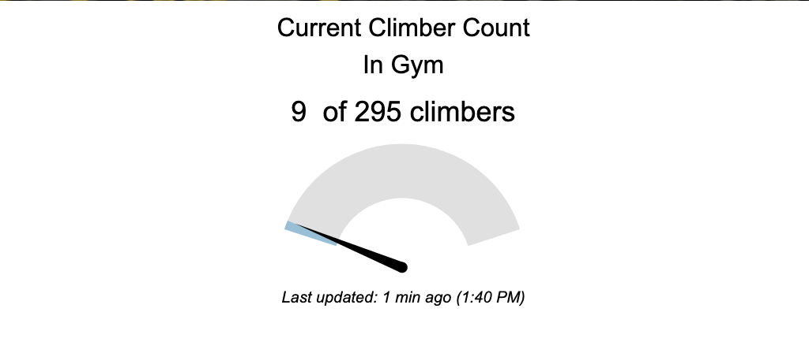
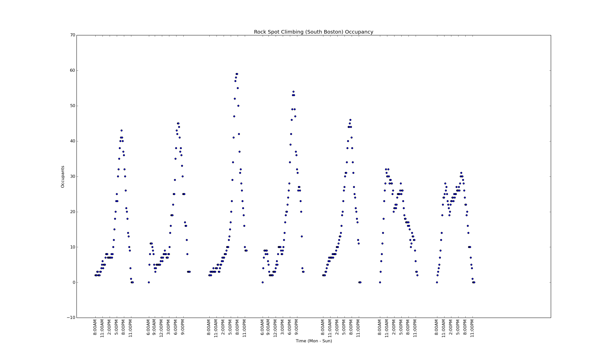

# rgp-occupancy

Append occupancy data for (climbing) gyms using [Rock Gym Pro][rgp] to a log file
and plot it. Best used with `cron` or some other scheduling daemon to collect
data over time.

The occupancy tracker looks like this:



```bash
# CSV file to append to.
export RGP_OCCUPANCY_LOG="occupancy.csv"

# Can be found from the browser network debugger when loading a site
# with Rock Gym Pro's occupancy tracker.
#
# Look for a request to `portal.rockgympro.com/portal/public/<FACILITY_ID>/occupancy`.
export RGP_OCCUPANCY_FACILITY_ID="7a2ec613bb982d4ba91785c2cdb45902"

# Can be found from the browser HTML inspector, in the JavaScript attached
# to the occupancy tracker.
#
# Look for a `<script>` HTML tag containing code that looks like:
#
# var data = {
#   '<FACILITY_TAG>': {
#     'capacity': 150,
#     'count': 2,
#     'subLabel': 'Current climber count',
#     'lastUpdate': 'Last updated:&nbspnow (1:23 PM)'
#   }
# }
export RGP_OCCUPANCY_FACILITY_TAG="SBO"

# Collect a single data point for Rock Spot (South Boston)
cargo run

# Plot all collected data
python plot.py $RGP_OCCUPANCY_LOG
```



[rgp]: https://www.rockgympro.com/
